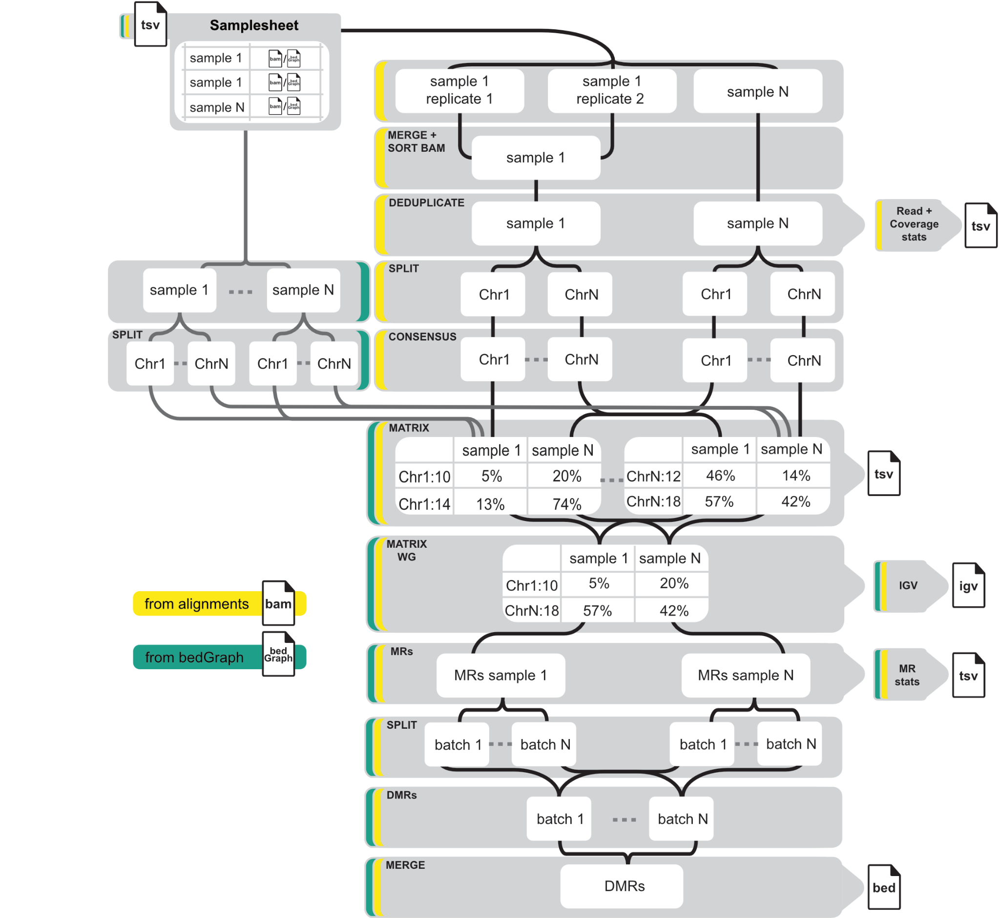

[](https://www.nextflow.io/)
# MethylScore

MethylScore is a pipeline to call differentially methylated regions between samples obtained from Whole Genome Bisulfite Sequencing (WGBS).

## Pipeline summary

MethylScore starts from bam files containing alignments of bisulfite-sequenced reads to a reference genome, produced by bisulfite read
alignment tools such as _[bismark](https://github.com/FelixKrueger/Bismark/)_ and _[bwa_meth](https://github.com/brentp/bwa-meth)_.
Alternatively, bedGraph files with pre-tabulated methylation information as they are produced by _[MethylDackel extract](https://github.com/dpryan79/MethylDackel#single-cytosine-methylation-metrics-extraction)_ or _[bismark methylation extractor](https://github.com/FelixKrueger/Bismark/tree/master/Docs#iv-running-bismark_methylation_extractor)_.

If genomic alignments are supplied as an input, mapped reads from technical replicates are first merged and coordinate-sorted using _samtools sort_, and the mappings for each sample are de-duplicated using _picard MarkDuplicates_.
For concurrent processing, the alignments are then split by chromosome, and, for each sample and chromosome, the numbers of methylated/unmethylated reads per position (pileup information) are retrieved using
_[MethylDackel extract](https://github.com/dpryan79/MethylDackel)_.

The obtained pileup information from all analysed samples is summarised in a so-called genome matrix that is generated per sample and chromosome in parallel.
The global genome matrix serves as input for the detection of methylated regions per sample and methylated regions (MRs)
are determined by a two-state Hidden Markov Model (HMM)-based method that learns different methylation level distributions for an unmethylated and a methylated state from whole genome data.
Finally, to obtain significant differences in methylation on a regional scale between different samples, MethylScore clusters samples by methylation levels and statistically tests the
groupwise methylation distributions for significant differences.



## Usage

### Getting started

All software dependencies required by MethylScore are provided in a [Docker container](quay.io/beckerlab/methylscore:nextflow), the only requirements to run MethylScore are [Nextflow](https://www.nextflow.io/),
and a supported container engine ([Singularity](https://www.sylabs.io/singularity/), [Docker](https://www.docker.com/), [Charliecloud](https://hpc.github.io/charliecloud/) or [Podman](https://podman.io/)).

### Pipeline input

MethylScore requires a samplesheet. It serves to create a mapping between sample identifiers and corresponding file locations of input files and should consist of two columns:

| sampleID |             path            |
| -------- | --------------------------- |
|    S1    | /path/to/S1A.{bam,bedGraph} |
|    S2    | /path/to/S2A.{bam,bedGraph} |
|    S2    | /path/to/S2B.{bam,bedGraph} |

> Samples sharing the same sampleID will be treated as technical replicates and merged prior to further processing.

To start the pipeline (using docker in this case), at least `--SAMPLE_SHEET` and `--GENOME` (in fasta format, same one as the reads were mapped against) have to be provided.

```bash
# If genomic alignments in bam format are provided
nextflow run Computomics/MethylScore --SAMPLE_SHEET=/path/to/samplesheet.tsv --GENOME=/path/to/reference_genome.fa -profile docker

# If bedGraph input is provided
nextflow run Computomics/MethylScore --BEDGRAPH --SAMPLE_SHEET=/path/to/samplesheet.tsv --GENOME=/path/to/reference_genome.fa -profile docker
```

### Pipeline output

The pipeline will create a output directory structure that looks like the following:

```bash
├── 01mappings
│   ├── S1
│   │   ├── S1.cov.avg
│   │   ├── S1.cov_stats.tsv
│   │   └── S1.read_stats.tsv
│   └── S2
│       ├── S2.cov.avg
│       ├── S2.cov_stats.tsv
│       └── S2.read_stats.tsv
├── 02consensus
│   └── mbias
│       ├── S1.Chr1_OB.svg
│       ├── S1.Chr1_OT.svg
│       ├── S2.Chr1_OB.svg
│       └── S2.Chr1_OT.svg
├── 03matrix
│   ├── genome_matrix.tsv.gz
│   └── genome_matrix.tsv.gz.tbi
├── 04MRs
│   ├── hmm_parameters
│   │   ├── S1.hmm_params
│   │   └── S2.hmm_params
│   ├── S1.MRs.bed
│   ├── S2.MRs.bed
│   └── stats
│       ├── S1.MR_stats.tsv
│       └── S2.MR_stats.tsv
├── 05DMRs
│    └── all
│        ├── DMRs.CG.bed
│        ├── DMRs.CHG.bed
│        └── DMRs.CHH.bed
├── MethylScore_graph.png
├── MethylScore_report.html
└── MethylScore_trace.txt     
```

#### 01mappings

Contains alignment statistics for each sample.
Sorted and de-duplicated bam files are optionally stored in this directory (if run with `--REMOVE_INTMED_FILES false`).

#### 02consensus

Contains mbias plots showing methylation with respect to position along the sequencing reads that should be used to (re-)assess read trimming settings as needed.
Single-cytosine pileup information for each sample is optionally stored in this directory (if run with `--REMOVE_INTMED_FILES false`).

#### 03matrix

Contains the merged whole genome matrix across all samples as a bgzip compressed file, along with the corresponding tabix index.
The genome matrix for each chromosome are optionally stored in this directory (if run with `--REMOVE_INTMED_FILES false`).

#### 04MRs

Contains genomic coordinates of methylated regions (MRs) as they were segmented by the Hidden Markov Model, along with associated region-based metrics.
The parameters obtained from training the model on each sample are stored and can be used to reduce computational burden in subsequent pipeline runs.

The coordinates are stored in bed format, with the following columns:

column 1: chromosome ID<br>
column 2: (1-based) start position<br>
column 3: (1-based) end position, half-open (i.e. this position is not part of the region)<br>
column 4: Number of covered cytosines in MR<br>
column 5: Mean read depth in MR<br>
column 6: 5th percentile of read depth in MR<br>
column 7: Mean methylation rate of cytosines within MR<br>
column 8: SampleID<br>

Example:

|   X1   |   X2  |  X3  |  X4  |  X5  |  X6 |  X7 |  X8 |
| ------ | ----- | ---- | ---- | ---- | --- | --- | --- |
|  Chr1  |  597  | 651  |  23  |  11  |  12 |  12 |  S1 |
|  Chr1  |  763  | 956  |  52  |   5  |   9 |  51 |  S1 |

#### 05DMRs

Contains genomic coordinates of differentially methylated regions (DMRs) that were determined as significantly different between sample clusters, after candidate region selection from MRs followed by statistical testing.

column 1: chromosome ID<br>
column 2: (1-based) start position<br>
column 3: (1-based) end position, half-open (i.e. this position is not part of the region)<br>
column 4: Length in bp<br>
column 5: Cluster-String, one symbol per sample:<br>
    * `1`,`2`,`3`,`...` = cluster ID<br>
    * `.` = sample is not covered at all positions within region<br>
    * `-` = sample is not sufficiently covered at all positions within region (at least `DMR_MIN_C` positions with a minimum read depth of `DMR_MIN_COV`-fold are required)<br>
column 6: Mean methylation rate of total sites, and of sites in the contexts CG, CHG, CHH (in this order) for cluster 1, comma-separated and preceded by the cluster ID and ":" (1:...)<br>
column 7: Mean methylation rate of total sites, and of sites in the contexts CG, CHG, CHH (in this order) for cluster 2, comma-separated and preceded by the cluster ID and ":" (2:...)<br>
column 8 to n-3: Potentially more mean methylation rates if there are more than 2 clusters<br>
column n-2: Number of total sites, and of sites in the contexts CG, CHG, CHH (in this order), comma-separated, and preceded by "#:"<br>
column n-1: Differentially methylated context<br>
column n: Highly differentially methylated context<br>

Example:

|   X1   |   X2   |   X3  |  X4  |     X5    |      X6      |      X7      |             X8         |      X9        |      X10     |  X11   |   X12  | 
| ------ | ------ | ----- | ---- | --------- | ------------ | ------------ | ---------------------- | -------------- | -----------  | ------ |  ----  |
|   Chr1 |  42255 | 42409 | 155  | 11.21-211 | 1:17,20,0,12 | 2:75,80,0,28 |        1:S1,S3,...     |   2:S2,S6,...  | #:30,14,3,13 | CG,CHH |   CHH  |


### Pipeline parameters

Pipeline parameters can either be configured using a [parameter file](https://github.com/Computomics/MethylScore/raw/nextflow/example_config.yaml), or 
individual parameters can be passed to the pipeline on the commandline.
For example, methylated regions can be visualized as [IGV](https://software.broadinstitute.org/software/igv/) tracks by passing the `--IGV` parameter via the commandline:

```bash
nextflow run Computomics/MethylScore --SAMPLE_SHEET=samplesheet.tsv --GENOME=genome.fa --IGV -profile podman
```

Alternatively, the repository contains a template [example_config.yaml](https://github.com/Computomics/MethylScore/raw/nextflow/example_config.yaml), which can be edited and used to pass custom parameters in a more reproducible manner to the pipeline using the `-params-file` flag.

```bash
nextflow run Computomics/MethylScore --SAMPLE_SHEET=samplesheet.tsv --GENOME=genome.fa -params-file=/path/to/config.yaml -profile podman
```

#### General parameters

<details>
 <summary>--SAMPLE_SHEET <code>required</code></summary>
 Path to sample sheet.
</details>

<details>
 <summary>--GENOME <code>required</code></summary>
 Path to fasta file containing reference genome.
</details>

<details>
 <summary>--BEDGRAPH <code>default: false</code></summary>
 Run MethylScore with bedGraph input.
</details>

<details>
 <summary>--PAIRWISE <code>default: false</code></summary>
  Activate the pairwise mode, which will run all pairwise combinations between a user-specified sampleID
  and each of the other samples. Use as --PAIRWISE followed by a sampleID from the first column of the samplesheet.
</details>

<details>
 <summary>--DO_DEDUP <code>default: true</code></summary>
 Perform read de-duplication using picard MarkDuplicates
</details>

<details>
 <summary>--IGV <code>default: false</code></summary>
 Generate <a href=https://software.broadinstitute.org/software/igv>IGV</a> tracks.
</details>

<details>
 <summary>--REMOVE_INTMED_FILES <code>default: true</code></summary>
 Do not store intermediate files.
</details>

<details>
 <summary>--PROJECT_FOLDER <code>default: './results'</code></summary>
 Path to sample sheet.
</details>

<details>
 <summary>--STATISTICS <code>default: true</code></summary>
 Collect coverage statistics on alignments.
</details>

<details>
 <summary>--ROI <code>default: false</code></summary>
 Supply regions of interest in bed format.
</details>

<details>
 <summary>--METRICS <code>default: true</code></summary>
 Generate runtime metrics with Nextflow.
</details>

<details>
 <summary>--MIN_QUAL <code>default: 30</code></summary>
  Minimum mapping quality of reads to consider (influenced by ploidy level!)
  Only applies when running from bam input.
</details>

<details>
 <summary>--IGNORE_OT <code>default: 0,0,0,0</code></summary>
  Disregard bases of original top strand for consensus calling (r1_start,r1_end,r2_start,r2_end)
  Useful for removal of methylation bias from read ends. Uses the same syntax as <a href=https://github.com/dpryan79/MethylDackel#alignment-trimming>MethylDackel extract</a>.
  Only applies when running from bam input.
</details>

<details>
 <summary>--IGNORE_OB <code>default: 0,0,0,0</code></summary>
  Disregard bases of original top strand for consensus calling (r1_start,r1_end,r2_start,r2_end)
  Useful for removal of methylation bias from read ends. Uses the same syntax as <a href=https://github.com/dpryan79/MethylDackel#alignment-trimming>MethylDackel extract</a>.
  Only applies when running from bam input.
</details>

#### MR parameters

<details>
 <summary>--MIN_COVERAGE <code>default: 1</code></summary>
  Minimum per-site coverage to consider
</details>

<details>
 <summary>--MR_FREQ_CHANGE <code>default: 20</code></summary>
 Percent MR frequency change (across all samples) leading to segment break.
</details>

<details>
 <summary>--MR_FREQ_DISTANCE <code>default: 30</code></summary>
 Upstream distance in bp to which MR frequency change is compared.
</details>

<details>
 <summary>--DESERT_SIZE <code>default: 100</code></summary>
  If a region spans more than <code>DESERT_SIZE</code> bp without covered cytosines, break segment and rather start separate HMM path.
</details>

<details>
 <summary>--MR_MIN_C <code>default: 20</code></summary>
  Minimum number of covered cytosines within MRs, turns off permutation test (set to -1 for turning on the permutation test)
</details>

<details>
 <summary>--MERGE_DIST <code>default: 30</code></summary>
  Merge MRs that are <code>MERGE_DIST</code> bp close to each other.
</details>

<details>
 <summary>--TRIM_METHRATE <code>default: 10</code></summary>
  Trim sites off both MR ends below this methylation level.
</details>

<details>
 <summary>--MR_PARAMS <code>default: false</code></summary>
  Provide pre-trained parameter file for calling MRs on all samples.
  If set to false, the hmm will train on each sample.
</details>

<details>
 <summary>--SLIDING_WINDOW_SIZE <code>default: 0</code></summary>
 If set to a value greater than 0, applies sliding window of width <code>SLIDING_WINDOW_SIZE</code> along segmented regions to breakdown candidate regions to test.
</details>

<details>
 <summary>--SLIDING_WINDOW_STEP <code>default: 0</code></summary>
 If <code>SLIDING_WINDOW_SIZE</code>  and <code>SLIDING_WINDOW_STEP</code> are set to values greater than 0, applies sliding window of size <code>SLIDING_WINDOW_SIZE</code> along selected regions to breakdown candidate regions to test, using a step size of <code>SLIDING_WINDOW_STEP</code> 
</details>

<details>
 <summary>--HUMAN <code>default: false</code></summary>
 If set to true, the segmentation will select hypomethylated regions instead of methylated regions.
 Useful if analysing human data.
</details>

<details>
 <summary>--MR_BATCH_SIZE <code>default: 500</code></summary>
  Number of MR blocks per file.
</details>

#### DMR parameters:

<details>
 <summary>--DMRS_PER_CONTEXT <code>default: true</code></summary>
 Call DMRs for each sequence context.
</details>

<details>
 <summary>--DMR_CONTEXTS <code>default: CG,CHG,CHH</code></summary>
 Sequence contexts to analyse.
</details>

<details>
 <summary>--CLUSTER_MIN_METH_DIFF{_CG,_CHG,_CHH} <code>default: 20</code></summary>
 Minimum methylation level differences per context between any pair of sample clusters.
 <code>CLUSTER_MIN_METH_DIFF_CG</code>,<code>CLUSTER_MIN_METH_DIFF_CHG</code> and <code>CLUSTER_MIN_METH_DIFF_CHH</code> only apply
 when <code>DMRS_PER_CONTEXT</code> is set to true.
</details>

<details>
 <summary>--CLUSTER_MIN_METH{_CG,_CHG,_CHH} <code>default: 20</code></summary>
 Minimum methylation level of any sample cluster per context.
 <code>CLUSTER_MIN_METH_CG</code>,<code>CLUSTER_MIN_METH_CHG</code> and <code>CLUSTER_MIN_METH_CHH</code> only apply
 when <code>DMRS_PER_CONTEXT</code> is set to true.
</details>

<details>
 <summary>--DMR_MIN_COV <code>default: 3</code></summary>
Minimum read coverage of cytosines within (candidate) DMRs.
</details>

<details>
 <summary>--DMR_MIN_C <code>default: 5</code></summary>
 Minimum number of cytosines exceeding <code>DMR_MIN_COV</code> that are required within (candidate) DMRs.
</details>

<details>
 <summary>--FDR_CUTOFF <code>default: 0.05</code></summary>
 False Discovery Rate threshold.
</details>

<details>
 <summary>--HDMR_FOLD_CHANGE <code>default: 3</code></summary>
 Minimum fold change between clusters to call hDMRs.
</details>

